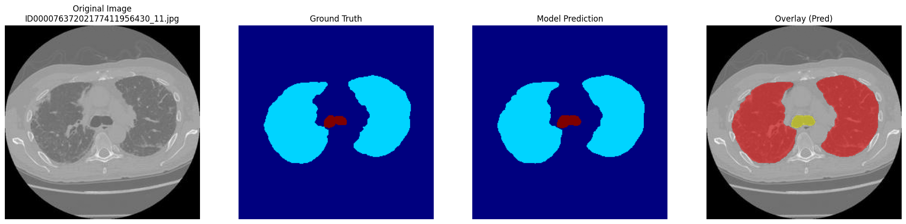

# 2D Chest CT Organ Segmentation

[English] | [简体中文](./README_zh.md)

A deep learning project for 2D thoracic organ segmentation in CT scans. This repository supports training from scratch using custom images and masks.

## Key Features

- **Training from Scratch**: Full pipeline for training on your own CT datasets.
- **Data Processing**: 
  - Input: 256x256 grayscale images.
  - Built-in conversion: Automatically transforms RGB color masks into **Label Maps** for training.
- **Model Zoo**: Includes three architecture choices:
  - `U-Net`
  - `Simple_NestNet` (UNet++)
  - `NestNet with Backbone`

## Segmentation Results

Here is an example of the model's performance after training:

  
  
<i>Figure 1: Comparison between Original CT and Segmented Masks</i>

## Quick Start

1. **Prepare Data**: Place your 256x256 grayscale images and RGB masks in the data folder.
2. **Preprocessing**: Use the internal script to convert RGB masks to label maps.
3. **Train**: Choose your model and start training.
